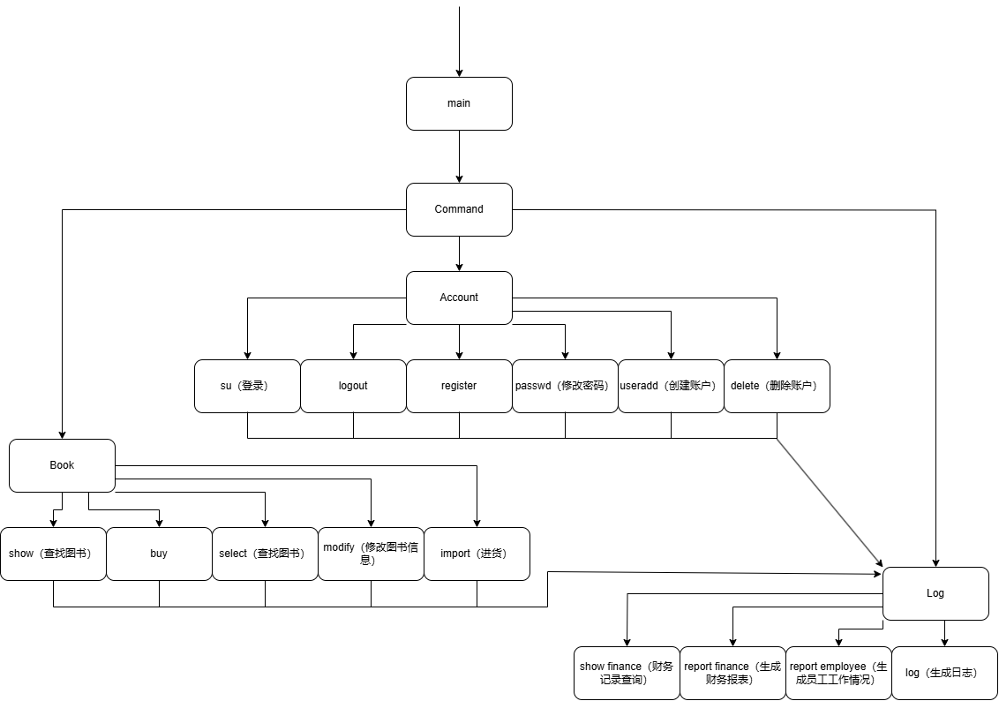

## Bookstore 2024

by 黄烨威

### 程序功能概述

这是一个由 C++ 实现的书店管理系统，利用命令行与用户进行交互。该书店管理系统面向三类人员：顾客、销售人员和店长，对不同人员权限提供不同的可执行操作。

### 主体逻辑说明

该系统包含以下几个板块:

- 指令分析

- 图书数据管理

- 账户管理

- 日志管理

运行流程: 输入指令 $\rightarrow$ 指令分析 $\rightarrow$ 图书数据管理/账户管理/日志管理 $\rightarrow$ 日志管理 $\rightarrow$ 输出结果。

### 代码文件结构

`main.cpp`: 程序的主文件, 负责接收输入的指令, 并传递给指令分析系统, 进行下一步的处理。

`Command.cpp`: 指令分析模块, 接收到 `main` 传来的指令后做出对应操作。

`Book.cpp`: 图书管理模块, 利用多个块状链表实现图书数据库的存储, 对图书相关操作作出响应。

`Account.cpp`: 账户管理模块, 利用块状链表实现账户数据的存储, 对账户相关操作作出响应。

`Log.cpp`: 日志管理模块, 对日志相关操作作出响应, 还要在其它模块操作后进行日志的更改。利用块状链表实现存储。

`BlockList.cpp`: 块状链表, 存储数据的基础。

### 功能设计

### 数据库设计

以下 6 组文件利用 块状链表 存储。

账户信息文件 (head/body): 以 `UserID` 为 key, 以 `账户类` 为 value.

图书信息文件1 (head/body): 以 `ISBN` 为 key, 以 `图书类` 为 value.

图书信息文件2 (head/body): 以 `BookName` 为 key, 以 `ISBN` 为 value.

图书信息文件3 (head/body): 以 `Author` 为 key, `ISBN` 为 value.

图书信息文件4 (head/body): 以 `Keyword` 为 key, 以 `图书类` 为 value.

员工工作情况 (head/body): 记录每个员工的操作，包含选择、修改、进货等。以 `UserID` 为 key, 以 `std::string` 为 value.

此后的文件无需采用块状链表。

财务信息文件: 以时间顺序, 存储 `财务信息类`。

财务报表文件: 以时间顺序, 用 `std::string` 存储全部交易的信息, 包含交易操作人、操作种类、操作金额等。

日志文件: 以时间顺序, 用 `std::string` 存储全部的操作信息。

共 15 个文件.

### 类、结构体设计

账户类 (`class Account`): 包含 `UserID` (最大长度 30 的字符串), `password` (最大长度 30 的字符串), `UserName` (最大长度 30 的字符串), `Privilege` (整型, 1/3/7).

图书类 (`class Book`): 包含 `ISBN` (最大长度 20 的字符串), `BookName` (最大长度 60 的字符串), `Author`(最大长度 60 的字符串), `Keyword`(最大长度 60 的字符串), `number` (非负整型), `price` (浮点数).

块状链表类 (`class BlockList`): 包含 `headFile`, `bodyFile` 两个文件流，可以以类似 `std::map` 的方式管理一堆 `pair(key, value)`, 其中 `key` 和 `value` 的类型可以自行指定，允许插入 (`insert`)、删除 (`mydelete`)、输出符合条件的信息 (`find`)。其中包含一些链表中的 `node` 类, 可以作为黑箱使用, 不再赘述。

财务信息类 (`class Finance`): 包含收入的前缀和 `income` (浮点数), 支出的前缀和 `expend` (浮点数).

### 补充说明

本系统所有浮点数精度为小数点后两位。