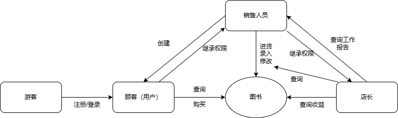
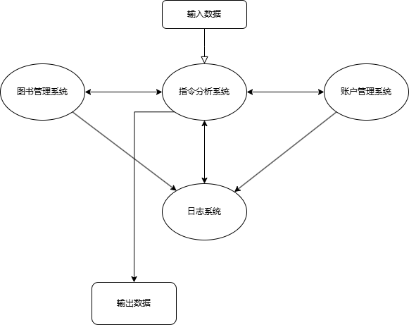

## 需求分析

实现一个图书管理系统, 由账户管理, 图书数据管理, 指令分析, 日志四个子系统组成.

分为四个用户权限等级: 游客 (lv.0), 顾客 (lv.1)，销售人员 (lv.2), 店长 (lv.3).

### 业务流图

### 数据流图

### 账户管理

#### 数据词典

存储账户, 每个账户有用户名 (字符串) 和密码 (字符串).

#### 功能说明与指令格式

注册 (lv.0): 返回注册成功/失败

登录 (lv.0): 返回登录成功/失败

用户创建 (lv.2): 返回创建成功/失败

### 图书数据管理

#### 数据词典

存储图书, 每个图书有 ISBN 号 (20 个字符, 每本正版书都有惟一的标识), 书名 (60 个字符), 作者 (60 个字符), 关键字 (可以有多个, 总共不超过 60 个字符), 库存量 (整型),单价 (非负实数).

#### 功能说明与指令格式

查询图书 (lv.1): 返回查询到的图书列表

购买图书 (lv.1): 返回购买成功/失败

进货 (lv.2): 返回进货成功/失败

图书信息录入 (lv.2): 返回录入成功/失败

图书信息修改 (lv.2): 返回修改成功/失败

### 指令分析

#### 数据词典

存储指令的合法格式. 如其他模块中的功能说明.

#### 功能说明与指令格式

分析指令: 返回是否是合法指令, 如是则执行, 并且输出对应的返回值

### 日志

#### 数据词典

存储工作日志: 采购信息/销售情况/盈利信息/员工的工作情况等.

#### 功能说明与指令格式

查询某段时间的采购信息 (lv.3): 返回采购信息

销售情况 (lv.3): 返回销售情况

盈利信息 (lv.3): 返回盈利信息

工作情况报告 (lv.3): 返回一名员工的工作情况

查询整体工作日志 (lv.3): 返回工作日志